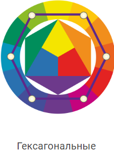
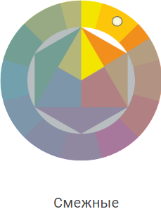
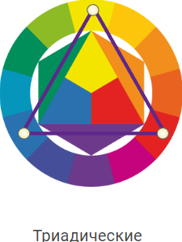

# NaVyhod bot
---

## _Описание идеи_:
Подобрать запоминающий образ довольно легко - достаточно правильно подобрать цвета. Но порой на это не хватате времени, желания или понимания как работают цветовые сочетания. С помощью данного Telegram-бота подбор гармоничных цветовых комбинаций стал доступнее и проще!

---
## _Общая структура алгоритма:_
На вход пользователь подате набор фотографий одежды из своего гардероба. Далее эти фотографии подаются на fine-tuned ResNet34 и алгоритм ML для определения одежды/обуви/аксессуара и цвета соответственно (см. схему ниже).

Полученные теги записываются в словарь и в зависимости от тега фото подаются на fine-tuned ResNet101 и 2xResNet34 для определения типа и подкласса одежды а также типа обуви (соответствено).
Все теги записываются в словарь для дальнейшего подбора образа по ним. 

Подбор одежды происходит следующим образом: 
Пользователь выбирает на основе какого типа вещей он хочет подобрать образ (брюки, джинсы, футболки, рубашки и т.д.) и какую цветовую комбинацию он хочет использовать (триадические, гексагональные или смежные цвета, см. картинку ниже)

  

Сначала происходит расчет "идеальной" цветовой комбинации для выбранных вещей. Например, если фтуболка белого цвета, то идеальной противоположной комбинацией были бы черные штаны и черные кроссовки. Но в гардеробе пользователя таких цветов может не быть, поэтому в ходе итерации по словарям происходит подбор наиболее близких по цвету вещей к рассчитанной ранее "идеальной" комбинации.

На выход алгоритм выдает все наиболее удачные комбинации выбранного типа одежды. 
